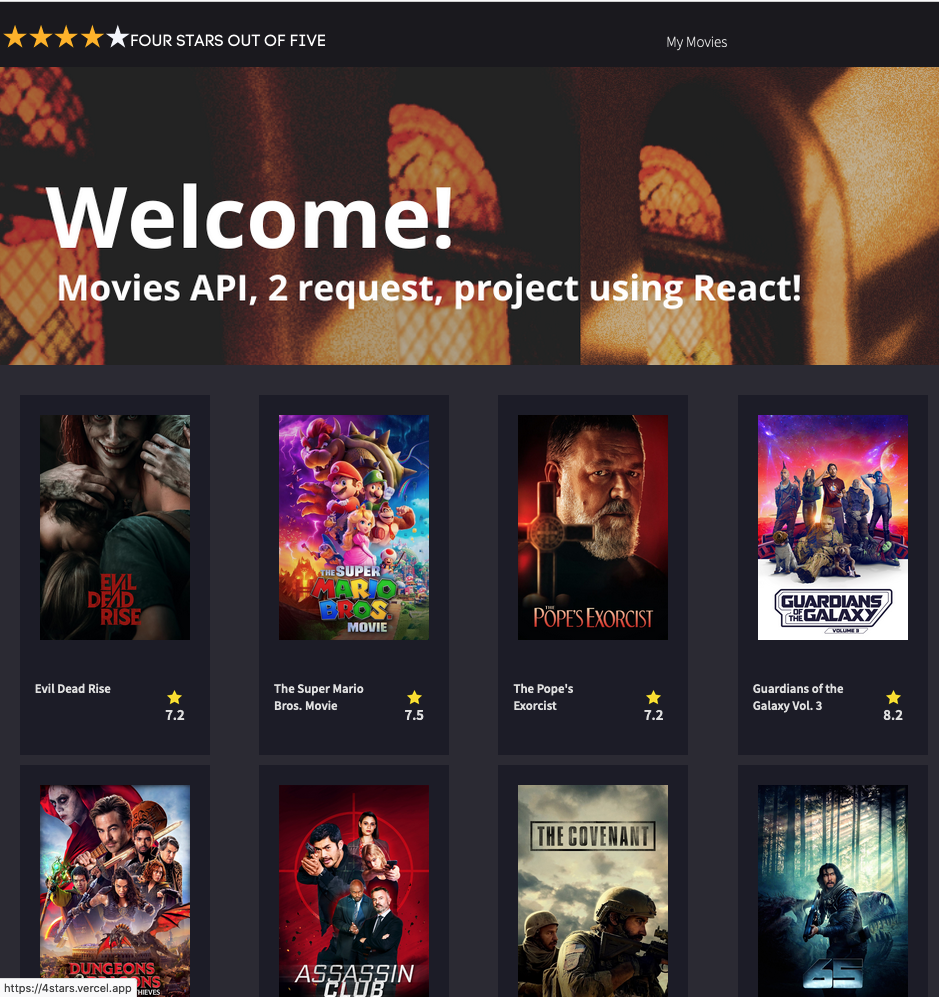

#          Movies Api 

This website is a movie library that dynamically fetches all the data through the public API of TMDB. It lists the top-rated movies based on their ratings, and includes a search field for users to perform searches.

Esse site é uma biblioteca de filme que puxa todo os dados de forma dinâmica atráves da API pública da TMDB. Listando os melhores filmes baseado em suas notas, com campo de busca e pesquisa.

### Deployment

This section has moved here: [https://facebook.github.io/create-react-app/docs/deployment](https://facebook.github.io/create-react-app/docs/deployment)

### `npm run build` fails to minify

This section has moved here: [https://facebook.github.io/create-react-app/docs/troubleshooting#npm-run-build-fails-to-minify](https://facebook.github.io/create-react-app/docs/troubleshooting#npm-run-build-fails-to-minify)
